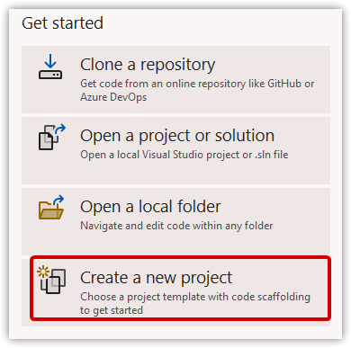
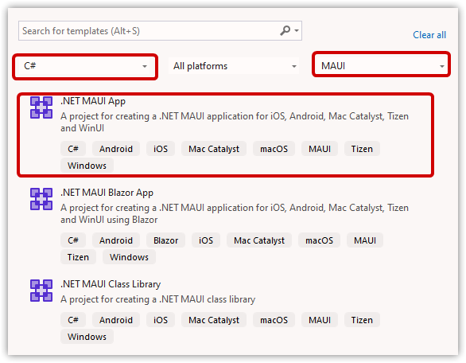
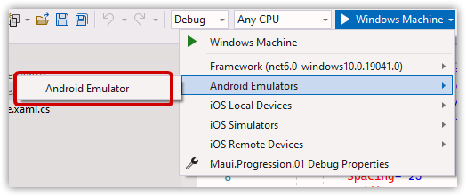
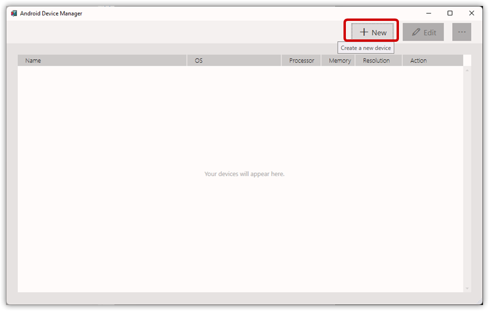
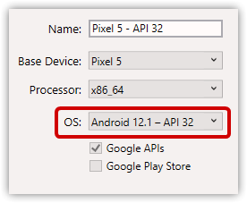
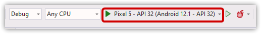
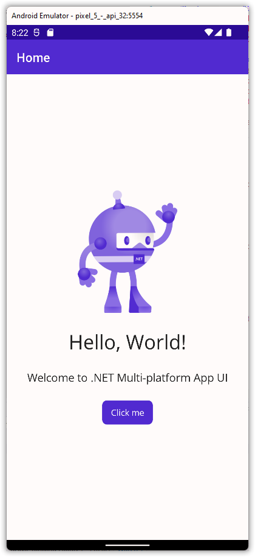
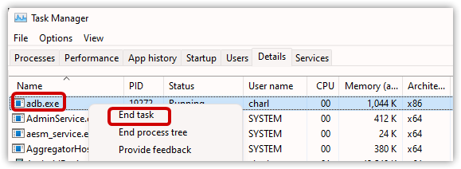

---  
Title          : .NET MAUI Progression 01 - From Basics to ViewModel  
PublishedOn    : 2022-06-20 07:51:00  
Slug           : _net_maui_progression_01_-_from_basics_to_viewmodel
Tags           :  
Status         : Draft  
---

## The Series


## The Problem .NET MAUI Solves


## (Brief) Getting Started: The Default App
The instructions assume running in Windows 10/11. You can follow the instructions below, which are brief and aren't intended as a beginner's guide. Or, use [Microsoft's official documents](https://docs.microsoft.com/en-us/dotnet/maui/get-started/first-app?pivots=devices-android).

### The Project

1.  Install and open Visual Studio 2022 Preview
1.  Create a new project
    
1.  Filter for C# MAUI, or search for ".NET MAUI App"
    
1. Create a .NET MAUI App using the defaults. Change the name to match mine if you want.

### The Android Emulator

> **Important**  
> You'll need to [enable either Hyper-V or HAXM](https://docs.microsoft.com/en-us/dotnet/maui/android/emulator/hardware-acceleration). 

> **Note**  
> I had trouble with Hyper-V on my laptop even though it's supported and had to use HAXM for a while. The problem went away when I did a clean install of Windows 11. Presumably, that would have been true in Windows 10.

1.  Choose Debug Target > Android Emulator
    
1.  Click to start the emulator. The Android Device Manager starts. Answer Yes to allow changes.
1.  You *can* accept the default Pixel 5 Android 12.0 (Level 31). However, I recommend canceling at this point and manually creating a Pixel 5 Android 12.1 (Level 32) or later. There are some behavior differences worth seeing, specifically in how the splash screen is treated.
      
      
1.  You don't need to explicitly start the emulator. Running the app will do that. So . . .
1.  Run the app!  
    

This should start the emulator, then install and run the default app. On my machine, this takes a couple of minutes.



Clicking the button increases a counter.

> **Warning**  
> Amazingly, as of 2022-06-20, using Android 12.1 as configured above, clicking the button doesn't display the number of clicks because of the padding. To fix this:
> 1.  Open `Mainpage.xaml`
> 1.  Change VerticalStackLayout Padding to "0,0".  
>     ```xml
>     <VerticalStackLayout 
>         Spacing="25" 
>         Padding="0,0" 
>     ```

## MVVM Basics
Great, we have a working app! And the .NET MAUI team have included lots of boilerplate to understand. But one thing not included is implementing the Model-View-ViewModel MVVM pattern.

We need to separate our code to improve maintenance and testing (more on testing in a later post!). One pattern for doing this is MVVM. Similar to Model-View-Controller (MVC), MVVM says, 

1.  The Model contains our raw domain information and business behaviors, which may come from various data sources. (See Domain-Driven Design.)
1.  The ViewModel typically retrieves the Model via a service. The ViewModel then prepares the information for display.
1.  The View displays whatever's in the ViewModel.

The *separation of concerns* here is that

1.  The View doesn't know how the ViewModel gets its information.
1.  The ViewModel doesn't know how the Model gets its information.

This allows us to make changes to the View, ViewModel, and Model mostly independently. We strive for *loose coupling*.

An important aspect of MVVM is how to bind the View to the ViewModel. The user interacts with the View, for example clicking a button to increment a counter. This updates the data stored in the ViewModel (and possibly gets passed to the Model).

However, we can also update the values programmatically directly in the ViewModel, and we want those values to display in the View. This is two-way binding.

There'll be more about binding later, but for an excellent tutorial of binding--in fact, of .NET MAUI in general--you should really go through [James Montemagno's Workshop](https://www.youtube.com/watch?app=desktop&v=DuNLR_NJv8U)


## Creating the ViewModel
Right now, when we click the app's button it runs code in the `MainPage.xaml.cs` class. If this looks familiar to some of you[^ancient], it's because it's the same code-behind approach used in ASP.NET WebForms.

[^ancient]: The ancient ones

It works, but is too tightly coupled. Let's pull that simple functionality into a ViewModel.

1.  Add the NuGet package `Microsoft.Toolkit.Mvvm`.
    > This is the same package as `CommunityToolkit.Mvvm`. Only the namespace differs.
1.  Add a folder named `ViewModels`, and a file named `Counter.cs`.
    > Some developers append their view models with "VM" or "ViewModel". That's fine, but I don't, 'cause that's what namespaces are for!
1.  Add the following code
    ```csharp
    using Microsoft.Toolkit.Mvvm.ComponentModel;
    using Microsoft.Toolkit.Mvvm.Input;

    namespace Maui.Progression.ViewModels;

    public partial class Counter : ObservableObject
    {
        [ObservableProperty]
        [AlsoNotifyChangeFor(nameof(CountText))]
        int count;

        public string CountText
        {
            get
            {
                string text = "Click me";
                if (count > 0)
                {
                    text = $"Clicked {count} " + (count == 1 ? "time" : "times");
                }            
                SemanticScreenReader.Announce(text);
                return text;
            }
        }

        [ICommand]
        void IncreaseCounter()
        {
            Count++;
        }
    }
    ```

The `Microsoft.Toolkit.Mvvm` package includes code generators to create all of the two-way binding code using the attributes. Here we've

*   Created an observable property named `Count` (the generator capitalizes the property name for us based on the backing field)
*   Created a read-only property named CountText. This is what we'll display.
*   Told the framework "when you notify of a change in Count, also notify there was a change in CountText."
*   Created a bindable command named IncreaseCounter to do the work.

> **Notes**  
> * Must be a partial class
> * Must inherit from ObservableObject
> * The `Count` property must be incremented, not the backing field.

Let's modify the MainPage view. Change the declarations.

```xml
<ContentPage xmlns="http://schemas.microsoft.com/dotnet/2021/maui"
             xmlns:x="http://schemas.microsoft.com/winfx/2009/xaml"
             x:Class="Maui.Progression._01.MainPage"
             xmlns:viewmodels="clr-namespace:Maui.Progression._01.ViewModels"
             x:DataType="viewmodels:Counter"
             >
```

This code allows Intellisense to work. It doesn't *perform* the binding. That's done in the code-behind as shown later.

*   Adds the ViewModels namespace
*   Declares the view is of type Counter.

Change the button code.

```xml
            <Button
                Text="{Binding CountText}"
                SemanticProperties.Hint="Counts the number of times you click"
                Command="{Binding IncreaseCounterCommand}"
                HorizontalOptions="Center" />
```

*   Binds the button text to our CountText property
*   Binds the button click to the IncreaseCounter command.
    > **Important** The toolkit code generator automatically appends "Command" to methods decorated with `ICommand`.

Finally, in the `MainPage.xaml.cs` code-behind, replace with this.

```csharp
using Maui.Progression._01.ViewModels;

namespace Maui.Progression._01;

public partial class MainPage : ContentPage
{
	public MainPage()
	{
		InitializeComponent();
		BindingContext = new Counter();
	}
}

```

This is what *actually* binds the View to the ViewModel. 

Running the code should behave as before.

## Tricks
Building for multiple platforms takes awhile. If you're willing to develop mostly for Windows, and check progress on Android/iOS/Mac occasionally, you can comment out the mobile targets.

```xml
<PropertyGroup>
    <!--<TargetFrameworks>net6.0-android;net6.0-ios;net6.0-maccatalyst</TargetFrameworks>-->
    <TargetFrameworks Condition="$([MSBuild]::IsOSPlatform('windows'))">$(TargetFrameworks);net6.0-windows10.0.19041.0</TargetFrameworks>

```


## Troubleshooting
If you get a message "The namespace already contains a definition for 'Counter'," double check you defined Counter as a partial class. You may then have to close Visual Studio, delete the project's bin and obj folders, restart Visual Studio, and build the project.

Sometimes I've seen the MVVM Toolkit generators/code get "stuck," probably due to some files being cached. Even if I comment out most of the class code, the error doesn't go away until I restart Visual Studio.

In some cases, I've cleaned up the VS generated documents. (But I don't know if this matters.)
1.  Open %LocalAppData%\Temp\VSGeneratedDocuments
1.  Delete all the folders

AND, if you're told you can't delete files because they're locked!!
1.  Close Visual Studio
1.  Close any open Android Emulator and the Android Device Manager
1. Open Task Manager (Ctrl+Shift+Esc)
1. Open the Details tab
1. End the adb.exe process  
   

AND IF THAT DOESN'T WORK!!!
Restart and try clearing those files again. And delete the project's obj/bin again.
Sheesh!

If you get this error

> Argument 1: cannot convert from 'System.ComponentModel.PropertyChangedEventArgs' to 'int'

double check your ViewModel class is inheriting from ObservableObject, *not* BindableObject.


```
Severity	Code	Description	Project	File	Line	Suppression State
Error	CS1503	Argument 1: cannot convert from 'System.ComponentModel.PropertyChangedEventArgs' to 'string'	Maui.Progression.01 (net6.0-android)	C:\Users\charl\source\repos\dotnet-maui-progression\src\Maui.Progression.01\Maui.Progression.01\Microsoft.Toolkit.Mvvm.SourceGenerators\Microsoft.Toolkit.Mvvm.SourceGenerators.ObservablePropertyGenerator\Maui.Progression._01.ViewModels.Counter.cs	22	Active
```

I had one case--while working on this article--where the above error occurred in two instances of adding a ViewModel to a new project before any binding was set. The problem went away eight hours later and after yet another reboot.

## Wrap Up
We've actually done quite a bit here to implement the MVVM pattern.

1.  Created a ViewModel with bindable properties and commands
1.  Updated the View to use the ViewModel
1.  Bound the two together

Next up: unit testing!