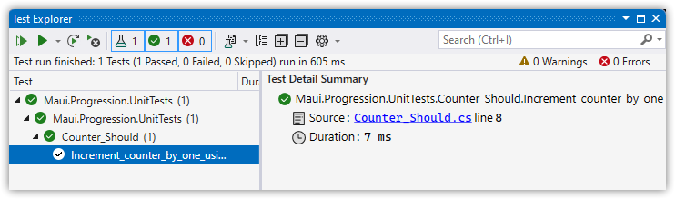

---  
Title          : .NET MAUI Progressing From a Default Project Part 2 - (The Problem With) Basic Unit Testing  
PublishedOn    : 2022-06-20 07:51:00  
Slug           : _net_maui_progressing_from_a_default_project_part_2_-__the_problem_with__basic_unit_testing  
Tags           :  
---

## The Series
Level: Moderate

This series assumes the developer is familiar with .NET MAUI, the Model-View-ViewModel pattern, and has worked through one or more tutorials such as the excellent [James Montemagno's Workshop](https://www.youtube.com/watch?app=desktop&v=DuNLR_NJv8U).

Source: [https://github.com/bladewolf55/net-maui-progression](https://github.com/bladewolf55/net-maui-progression)

*   [Part 1 - Adding the View Model](https://www.softwaremeadows.com/posts/_net_maui_progressing_from_a_default_project_part_1_-_adding_the_view_model/)
*   [Part 2 - (The Problem With) Basic Unit Testing](https://www.softwaremeadows.com/posts/_net_maui_progressing_from_a_default_project_part_2_-__the_problem_with__basic_unit_testing)

## .NET MAUI's testing problem
At the time of this writing, .NET MAUI apps don't support unit testing. At least, not in any way I could find. And I tried, I really tried, to fool .NET by playing with target frameworks and conditionally including a Program Main method, and other goofy stuff, but to no avail. 

So, that's the bad news, a real bummer, and in my opinion a terrible oversight on the .NET MAUI team's part. There's no talk of unit testing, no guidance, no explanation. 

Here's the good news: you can unit test .NET MAUI class libraries. Examples can be found at the [Community Toolkit repository](https://github.com/CommunityToolkit/Maui/tree/main/src/CommunityToolkit.Maui.UnitTests) (thank you, open source!).

This means we need to separate anything we want to unit test into a library. That's not ideal, especially for smaller projects, but we'll make do. I have confidence Microsoft is working on a better way.

## Add the ViewModels library
To keep things organized, let's add a ViewModels library. Later, we'll add a Models library.

> You could also have a single library for testable code, broken into namespaces. I would do that here, but, frankly, I wasn't sure what to name it! Plus, separate libraries reenforces our separation of concerns.

1.  Solution > Add > New Project > .NET MAUI Class Library named "Maui.Progression.ViewModels".
1.  Install the Microsoft.Toolkit.Mvvm package, and uninstall that package from the app project.
1.  Delete the `Class1.cs` file.
1.  Copy or move the `Counter.cs` file to the root of the ViewModels library.
1.  In the app project, delete the ViewModels folder.
1.  In the app project, add the ViewModels project as a project reference.
1.  Update the `MainPage.xaml` viewmodels namespace.  
    ```xml
    xmlns:viewmodels="clr-namespace:Maui.Progression.ViewModels;assembly=Maui.Progression.ViewModels"
    ```

> At this point you may need to do a Solution Clean and Rebuild, or even close Visual Studio, delete the bin/obj folders, and restart then build.

> For example, I got this warning:
>
> ```text
> Warning	WMC1006	Cannot resolve Assembly or Windows Metadata file 'C:\Users\charl\source\repos\dotnet-maui-progression\src\Maui.Progression.02\Maui.Progression.ViewModels\bin\Debug\net6.0-windows10.0.19041.0\Maui.Progression.ViewModels.dll'	Maui.Progression	C:\Users\charl\source\repos\dotnet-maui-progression\src\Maui.Progression.02\Maui.Progression\Maui.Progression.csproj
> ```

Running the app should behave as before.

## Add the testing project
> My preferred unit testing stack is [xUnit](https://xunit.net/), [FluentAssertions](https://fluentassertions.com/), and [NSubstitute](https://nsubstitute.github.io/). I'm keeping this tutorial simple by using vanilla xUnit.

1.  Solution > Add > New Project > xUnit Test Project named "Maui.Progression.UnitTests"
1.  Add `Maui.Progression.ViewModels` as a project reference.
1.  Rename `UnitTest1.cs` to `Counter_Should.cs`  
    > This is just my preferred naming convention.
1.  Update `Counter_Should.cs` with this code.
    ```csharp
    using Maui.Progression.ViewModels;

    namespace Maui.Progression.UnitTests;

    public class Counter_Should
    {
        [Fact]
        public void Increment_counter_by_one_using_command()
        {
            // arrange
            int expected = 1;
            var vm = new Counter();

            // verify the starting count
            Assert.True(vm.Count == 0, "Starting count should have been zero.");

            // act
            vm.IncreaseCounterCommand.Execute(null);

            // assert
            Assert.Equal(expected, vm.Count);
        }
    }
    ```

Run the test, which should pass.



As a final check, rerun the app.

## Wrap Up
We've separated out our View Model into a testable library, and written a simple passing test. We haven't written any kind of UI test, but that's OK for now. In a future part, I hope to try out the [Visual Studio App Center](https://appcenter.ms/), which appears purpose-built for multi-platform UI testing.

Next up: adding a Model!

## Resources
*   [Unit Testing Is Part Of A Developer's Job Description | Software Meadows](https://www.softwaremeadows.com/posts/unit_testing_is_part_of_a_developers_job_description/)
