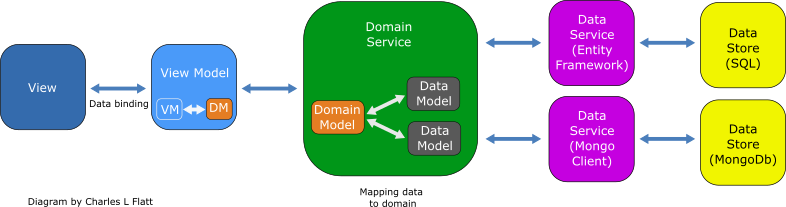
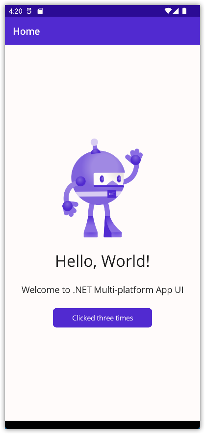

---  
Title          : .NET MAUI Progressing From a Default Project Part 3 - Adding the Model, More Testing, and DDD   
PublishedOn    : 2022-07-02 16:45:08  
Slug           : net_maui_progressing_from_a_default_project_part_3_-_adding_the_model_more_testing_and_ddd
Tags           :  
---

## The Series
Level: Moderate

This series assumes the developer is familiar with .NET MAUI, the Model-View-ViewModel pattern, and has worked through one or more tutorials such as the excellent [James Montemagno's Workshop](https://www.youtube.com/watch?app=desktop&v=DuNLR_NJv8U).

Source: [https://github.com/bladewolf55/net-maui-progression](https://github.com/bladewolf55/net-maui-progression)

*   [Part 1 - Adding the View Model](https://www.softwaremeadows.com/posts/net_maui_progressing_from_a_default_project_part_1_-_adding_the_view_model/)
*   [Part 2 - (The Problem With) Basic Unit Testing](https://www.softwaremeadows.com/posts/net_maui_progressing_from_a_default_project_part_2_-__the_problem_with__basic_unit_testing)
*   [Part 3 - Adding the Model](https://www.softwaremeadows.com/posts/net_maui_progressing_from_a_default_project_part_1_-_adding_the_model/)

## The Role of the Model in MVVM


<sup>Ugaya40, CC BY-SA 3.0 <https://creativecommons.org/licenses/by-sa/3.0>, via Wikimedia Commons</sup>

The purpose of the Model in MVVM is the same as in MVC. It's a class that either models a part of the domain (the way the business sees itself) or the data. In enterprise applications practicing Domain-Driven Design, a service usually populates the Domain Model from Data Models (abstractions of the various data sources).

Here's a more accurate diagram of a complex system.



We probably won't go deep into the data portion[^deep], but getting the Model from a service is pretty common. Along the way, we'll write unit tests.

[^deep]: Or we might!

## The Feature
We'll implement a simple feature: display the word for the number of button taps up to ten. To do that, we'll get a map of numbers to words from our service.

## The Architecture
Here's the namespace/folder layout we'll end up with. I'm following a general DDD/Onion Architecture.

```text
Solution
|_Maui.Progression
|_Maui.Progression.Domain
  |_Models
    |-NumberMap.cs
    |-NumberMapItem.cs
|_Maui.Progression.DomainServices
  |_Interfaces
    |-INumberMapper.cs
  |_NumberMapper.cs
|_Maui.Progression.UnitTests
  |-Counter_Should.cs
  |-NumberMap_Should.cs
  |-NumberMapperService_Should.cs
|_Maui.Progression.ViewModels
```


## The Domain Models
1.  Add two new .NET Class Library projects, one named `Maui.Progression.Domain`, the other named `Maui.Progression.DomainServices`.  
    > These are plain class libraries, not specific to .NET MAUI.
1.  Add a `Models` folder.
1.  Delete `Class1.cs`, add `NumberMapItem.cs` to Models with this code.  
    ```csharp
    namespace Maui.Progression.Domain.Models;

    public class NumberMapItem
    {
        public int Number { get; set; }
        public string Word { get; set; } = string.Empty;

    }    
    ```

Next, we'll create a domain model for the collection of number map items, so let's create a test. In `Maui.Progression.UnitTests`,

1.  Add a project dependency to `Maui.Progression.Domain`.
1.  Add a class named `NumberMap_Should.cs` with this code.

```csharp
using Maui.Progression.Domain;

namespace Maui.Progression.UnitTests;

public class NumberMap_Should
{
    [Fact]
    public void Return_words_for_numbers()
    {
        // arrange
        var map = new NumberMap();

        // act
        map.Map = new List<NumberMapItem>()
        {
            new NumberMapItem() { Number = 0, Word = "zero"},
            new NumberMapItem() { Number = 1, Word = "one"},
            new NumberMapItem() { Number = 2, Word = "two"},
            new NumberMapItem() { Number = 3, Word = "three"},
            new NumberMapItem() { Number = 4, Word = "four"},
            new NumberMapItem() { Number = 5, Word = "five"},
            new NumberMapItem() { Number = 6, Word = "six"},
            new NumberMapItem() { Number = 7, Word = "seven"},
            new NumberMapItem() { Number = 8, Word = "eight"},
            new NumberMapItem() { Number = 9, Word = "nine"},
            new NumberMapItem() { Number = 10, Word ="ten"}
        };

        // assert
        Assert.Equal("zero", map.ToWord(0));
        Assert.Equal("one",  map.ToWord(1));
        Assert.Equal("two",  map.ToWord(2));
        Assert.Equal("three",map.ToWord(3));
        Assert.Equal("four", map.ToWord(4));
        Assert.Equal("five", map.ToWord(5));
        Assert.Equal("six",  map.ToWord(6));
        Assert.Equal("seven",map.ToWord(7));
        Assert.Equal("eight",map.ToWord(8));
        Assert.Equal("nine", map.ToWord(9));
        Assert.Equal("ten",  map.ToWord(10));
    }

    [Fact]
    public void Return_null_if_number_not_found()
    {
        // arrange
        var map = new NumberMap();

        // act
        // assert
        Assert.Empty(map.Map);
        Assert.Null(map.ToWord(0));

    }
}
```

It's contrived, I know, but we have two tests, one to make sure we return words for numbers, the other for what happens if a number doesn't have a word.

Now add the class `NumberMap.cs` to the Models folder with this code to pass the tests.

```csharp
using System;
using System.Collections.Generic;
using System.Linq;
using System.Text;
using System.Threading.Tasks;

namespace Maui.Progression.Domain.Models
{
    public class NumberMap
    {
        public List<NumberMapItem> Map { get; set; } = new();

        public string? ToWord(int number) => Map.SingleOrDefault(a => a.Number.Equals(number))?.Word;

    }
}
```

## The Domain Service
Our domain service will return the domain model. Again, this is all overkill in reality, but it demonstrates the techniques.

1.  In the unit tests project, add a project reference to the DomainServices project.
1.  Add a unit test class named `NumberMapperService_Should.cs` with this code.

```csharp
using Maui.Progression.DomainServices;

namespace Maui.Progression.UnitTests;

public class NumberMapperService_Should
{
    readonly NumberMapper numberMapper;

    // This would normally be an injectable data service
    // such as Entity Framework. We'd use an in-memory database
    // to mock our data access.
    readonly string numberData = @"[
{""number"":1, ""word"":""one""},
{""number"":3, ""word"":""three""},
{""number"":5, ""word"":""five""}
]";

    public NumberMapperService_Should()
    {        
        numberMapper = new NumberMapper(numberData);
    }

    [Fact]
    public void Return_a_populated_NumberMap()
    {
        // arrange
        // act
        var result = numberMapper.GetNumberMap();

        // assert
        Assert.NotEmpty(result.Map);
        Assert.Equal(3, result.Map.Count);
        Assert.Equal("one", result.ToWord(1));
        Assert.Equal("three", result.ToWord(3));
        Assert.Equal("five", result.ToWord(5));
    }
}
```

The above code declares the service and injects our own test data instead of letting it get data from an external source.

Add an `Interfaces` folder and an interface to DomainServices named `INumberMapper.cs` with this code.

```csharp
using Maui.Progression.Domain.Models;

namespace Maui.Progression.DomainServices.Interfaces;

public interface INumberMapper
{
    NumberMap GetNumberMap();
}
```

We'll use this interface later to test our ViewModel.

> The principles here are A) program to the interface, and B) dependency injection. By injecting an interface, we can mock the behavior later.

Add a class named `NumberMapper.cs` to DomainServices.

```csharp
using Maui.Progression.Domain.Models;
using Maui.Progression.DomainServices.Interfaces;
using System.Text.Json;

namespace Maui.Progression.DomainServices
{
    public class NumberMapper : INumberMapper
    {
        string numberData = @"[
{""number"":1, ""word"":""one""},
{""number"":2, ""word"":""two""},
{""number"":3, ""word"":""three""},
{""number"":4, ""word"":""four""},
{""number"":5, ""word"":""five""},
{""number"":6, ""word"":""six""},
{""number"":7, ""word"":""seven""},
{""number"":8, ""word"":""eight""},
{""number"":9, ""word"":""nine""},
{""number"":10, ""word"":""ten""}
]";

        public NumberMapper(string numberData = "")
        {
            // Normally numberData would be an injectable data service
            // like Entity Framework.
            // Here we're letting the unit test inject test data. If empty,
            // assume the data service returned values 1-10.
            if (!String.IsNullOrEmpty(numberData))
                this.numberData = numberData;
        }
        public NumberMap GetNumberMap()
        {
            // Get our data and map it to our domain model list of map items.
            var options = new System.Text.Json.JsonSerializerOptions();
            options.PropertyNameCaseInsensitive = true;
            var items = JsonSerializer.Deserialize<List<NumberMapItem>>(numberData, options);
            // Populate the NumberMap domain model
            var map = new NumberMap() { Map = items ?? new List<NumberMapItem>() };
            // Return the domain model
            return map; ;
        }
    }
}
```

The class looks busy, but that's because of simulating getting JSON data from a database or external service. The method under test, `GetNumberMap`, is really pretty simple and follows a common pattern.

1.  Get external data.
1.  Map the data to our domain model.
1.  Return the model.

The test should pass! Note that we're *injecting* our test data, which is why we can assert that there are three items. When we use call the service from our ViewModel, it'll default to returning ten items.

## Updating the ViewModel to Use the Service
Let's update our ViewModel `Counter_Should` tests to use the service. To do this, we need to mock the service, and let's start making our assertions easier to construct and read. In the Unit Tests project install two NuGet packages.

*   NSubstitute
*   FluentAssertions

> Of course, you can use your preferred mocking library such as Moq, and your preferred assertion library such as Shouldly.

We need to do some prep before our test so that our solution builds with our dependency injection.

In ViewModels, open the `Counter` view model and update these top several lines. This will *not* pass the test!

```csharp
using Maui.Progression.DomainServices;
using Maui.Progression.DomainServices.Interfaces;
using Microsoft.Toolkit.Mvvm.ComponentModel;
using Microsoft.Toolkit.Mvvm.Input;

namespace Maui.Progression.ViewModels;

public partial class Counter : ObservableObject
{
    readonly INumberMapper numberMapperService;

    [ObservableProperty]
    [AlsoNotifyChangeFor(nameof(CountText))]
    int count;

    public Counter(INumberMapper numberMapperService) => this.numberMapperService = numberMapperService ?? new NumberMapper();

. . .
```

In the app, open `Mainpage.xaml.cs` and change to this. Notice we're now injecting the Counter view model.

```csharp
using Maui.Progression.ViewModels;

namespace Maui.Progression;

public partial class MainPage : ContentPage
{
	public MainPage(Counter viewModel)
	{
		InitializeComponent();
		BindingContext = viewModel;
	}
}
```

Open `MauiProgram.cs` and change to this. We're configuring the application's dependency injection service, telling it "If a parameter is of this type, then automatically create or use an existing instance so I don't have to code it myself."

```csharp
using Maui.Progression.DomainServices.Interfaces;
using Maui.Progression.ViewModels;

namespace Maui.Progression;

public static class MauiProgram
{
	public static MauiApp CreateMauiApp()
	{
		var builder = MauiApp.CreateBuilder();
		builder
			.UseMauiApp<App>()			
			.ConfigureFonts(fonts =>
			{
				fonts.AddFont("OpenSans-Regular.ttf", "OpenSansRegular");
				fonts.AddFont("OpenSans-Semibold.ttf", "OpenSansSemibold");
			});

		builder.Services.AddSingleton<INumberMapper>(new NumberMapper());
		builder.Services.AddSingleton<Counter>();
		builder.Services.AddSingleton<MainPage>();

        return builder.Build();
	}
}
```

Now we can update the `Counter_Should` test class.

```csharp
using Maui.Progression.ViewModels;
using FluentAssertions;
using NSubstitute;
using Maui.Progression.DomainServices.Interfaces;
using Maui.Progression.Domain.Models;

namespace Maui.Progression.UnitTests;

public class Counter_Should
{
    readonly INumberMapper numberMapperService;
    Counter? counter;

    public Counter_Should()
    {
        // Mock the service interface. We want to control the domain model it returns.
        numberMapperService = Substitute.For<INumberMapper>();
    }

    [Fact]
    public void Increment_counter_by_one_using_command()
    {
        // arrange
        int expectedNumber = 1;
        string expectedWord = "one";
        NumberMap map = new()
        {
            Map = new List<NumberMapItem>()
            {
                new NumberMapItem() { Number = expectedNumber, Word = expectedWord }
            }
        };
        numberMapperService.GetNumberMap().Returns(map);

        // Inject the service into the view model
        counter = new Counter(numberMapperService);

        // verify the starting count
        counter.Count.Should().Be(0, "starting count should have been zero.");

        // act
        counter.IncreaseCounterCommand.Execute(null);

        // assert
        counter.Count.Should().Be(expectedNumber);
        counter.CountText.Should().Contain(expectedWord);
    }
}
```

What's going on here?

1.  Declare our service interface and Counter view model
1.  Mock the service. We don't want it calling the outside world. We want to control its behavior.
1.  Inject our mocked service into the view model
1.  Test that the view model increments by 1, and the text contains "one".
1.  Part of the test includes explicitly setting what NumberMap object the service will return before instantiating the view model.

> **Confession**  
> Right about here I had to close Visual Studio, delete all the solution bin and obj folders, reopen Visual Studio and rebuild the solution. I kept getting a "Cannot resolve Assembly" warning in ViewModels/bin/Debug. When I rebuilt, it revealed errors that weren't being listed before. But this won't happen to you, of course!

At this point, you should be able to build the solution and run the test, which will fail. But not the way I expected.

> System.IO.FileNotFoundException : Could not load file or assembly 'Microsoft.Maui.Essentials,

Well, heck. How is the solution building but not running for the test? It's because of this line in `Counter.cs`.

```csharp
SemanticScreenReader.Announce(text);
```

Our test doesn't have a .NET MAUI platform context, so it can't run the SemanticScreenReader. The purpose of this is accessibility. We don't want to lose that, but Microsoft hasn't made it easy on us.

> **Confession**  
> Ugh, so I hate to do this, but for this tutorial the "solution" is to comment out the `SemanticScreenReader.Announce` statement. It looks like the way to get this working is mocking the application context. I'll try that in a later post so I can give it my full attention.

```csharp
// SemanticScreenReader.Announce(text);
```

With the above commented out, the test should run and fail.

```text
Expected counter.CountText "Clicked 1 time" to contain "one".
```

Update the `Counter.cs` class like so to get the test to pass.

```csharp
using Maui.Progression.Domain.Models;
using Maui.Progression.DomainServices;
using Maui.Progression.DomainServices.Interfaces;
using Microsoft.Toolkit.Mvvm.ComponentModel;
using Microsoft.Toolkit.Mvvm.Input;

namespace Maui.Progression.ViewModels;

public partial class Counter : ObservableObject
{
    readonly INumberMapper numberMapperService;
    readonly NumberMap map = new();

    [ObservableProperty]
    [AlsoNotifyChangeFor(nameof(CountText))]
    int count;

    public Counter(INumberMapper numberMapper) { 
        this.numberMapperService = numberMapper ?? new NumberMapper();
        map = numberMapperService.GetNumberMap();
    }

    public string CountText
    {
        get
        {
            string text = "Click me";
            if (count > 0)
            {
                var word = map.ToWord(count) ?? "Unknown";
                text = $"Clicked {word} " + (count == 1 ? "time" : "times");
            }
            // SemanticScreenReader.Announce(text);
            return text;
        }
    }

    [ICommand]
    void IncreaseCounter()
    {
        Count++;
    }
}
```

## Run the App
Of course, run the app, 'cause passing unit tests doesn't guarantee success, it just improves the odds.

> **Confession**  
> Mine didn't run right the first time. I forgot to pass the options to the JSON deserializer. Which led me to improving the test.



## Wrap Up
Properly adding a domain model involved quite a bit of work. Hopefully it's also clear that the increase in code resulted in a significant increase in testability. 

Next up: Refactoring the View!

## References
Jeffrey Palermo codified the Onion Architecture many years ago. I use it. I think you should, too.

[Onion Architecture: Part 4 – After Four Years | Programming with Palermo](https://jeffreypalermo.com/2013/08/onion-architecture-part-4-after-four-years/)

Steve Smith is an excellent developer. So is Julie Lerman. They're so good that even though I haven't watched this course, I'm sure it's tops.

[Domain-Driven Design Fundamentals | Pluralsight](https://www.pluralsight.com/courses/fundamentals-domain-driven-design)

And I'll bet this YouTube presentation is a great intro.

[Clean Architecture with ASP.NET Core with Steve Smith | Hampton Roads .NET Users Group - YouTube](https://www.youtube.com/watch?v=tdiOqW4ZYu4)
