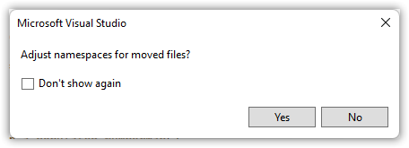

---  
Title          : .NET MAUI Progressing From a Default Project Part 4 - Putting the View in Its Place   
PublishedOn    : 2022-07-04 19:00:47 
Slug           : net_maui_progressing_from_a_default_project_part_4_-_putting_the_view_in_its_place
Tags           :  
---

## The Series
Level: Moderate

This series assumes the developer is familiar with .NET MAUI, the Model-View-ViewModel pattern, and has worked through one or more tutorials such as the excellent [James Montemagno's Workshop](https://www.youtube.com/watch?app=desktop&v=DuNLR_NJv8U).

Source: [https://github.com/bladewolf55/net-maui-progression](https://github.com/bladewolf55/net-maui-progression)

*   [Part 1 - Adding the View Model](https://www.softwaremeadows.com/posts/net_maui_progressing_from_a_default_project_part_1_-_adding_the_view_model/)
*   [Part 2 - (The Problem With) Basic Unit Testing](https://www.softwaremeadows.com/posts/net_maui_progressing_from_a_default_project_part_2_-__the_problem_with__basic_unit_testing)
*   [Part 3 - Adding the Model](https://www.softwaremeadows.com/posts/net_maui_progressing_from_a_default_project_part_3_-_adding_the_model_more_testing_and_ddd/)
*   [Part 4 - Putting the View in Its Place](https://www.softwaremeadows.com/posts/net_maui_progressing_from_a_default_project_part_4_-_putting_the_view_in_its_place/)

## Moving the View
Compared to the [last part](https://www.softwaremeadows.com/posts/net_maui_progressing_from_a_default_project_part_3_-_adding_the_model_more_testing_and_ddd/), this one's really short.

Our app has one view, MainPage, sitting in the root of the project. Like the rest of this series, that's fine for a small app with just a few views. But let's keep our app tidy and pretend it's going to have a dozen views.

> Which might be an awful lot for a mobile app.

In the `Maui.Progression` project, add a folder named "Views" and move the MainPage files (`MainPage.xaml` and `MainPage.xaml.cs`) into it. When prompted to adjust namespaces, choose Yes.



Trickery, trickery, trickery![^farside] *Neither* of our files' namespaces got updated. 

[^farside]: From The Far Side by Gary Larson  
    

Open `MainPage.xaml.cs` and update the namespace.

```csharp
using Maui.Progression.ViewModels;

namespace Maui.Progression.Views;
```

Open `MainPage.xaml` and update the page's x:Class namespace. 

```xml
<?xml version="1.0" encoding="utf-8" ?>
<ContentPage xmlns="http://schemas.microsoft.com/dotnet/2021/maui"
             xmlns:x="http://schemas.microsoft.com/winfx/2009/xaml"
             x:Class="Maui.Progression.Views.MainPage"
```

We also need to edit `MauiProgram.cs` to add `Maui.Progression.Views`.

```csharp
using Maui.Progression.DomainServices;
using Maui.Progression.DomainServices.Interfaces;
using Maui.Progression.ViewModels;
using Maui.Progression.Views;
```

*And* the `AppShell.xaml` "local" namespace.

```xml
<?xml version="1.0" encoding="UTF-8" ?>
<Shell
    x:Class="Maui.Progression.AppShell"
    xmlns="http://schemas.microsoft.com/dotnet/2021/maui"
    xmlns:x="http://schemas.microsoft.com/winfx/2009/xaml"
    xmlns:local="clr-namespace:Maui.Progression.Views"
```

Run the program and the tests. Et voila! it works.

## Wrap Up
I know, I know. "Jeez, that was easy, what was the point?"

The point is that we now have a well-organized application, which increases maintainability. We're following a View-Model-ViewModel pattern, and our Views, View Models, and Models are corralled into their metaphorical pens. We also saw just how pervasive and important the namespaces are, and that--unlike some other refactoring--Visual Studio doesn't (today) catch everything.

Next Up: Build and (hopefully some kind of) Deployment (and then view layouts and styles)!
