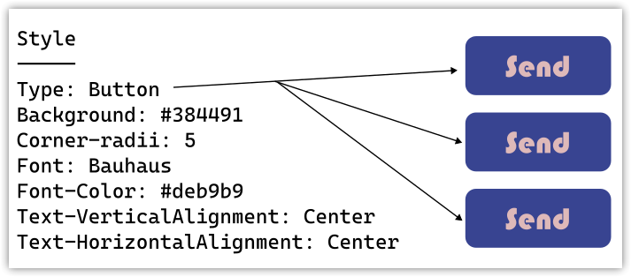
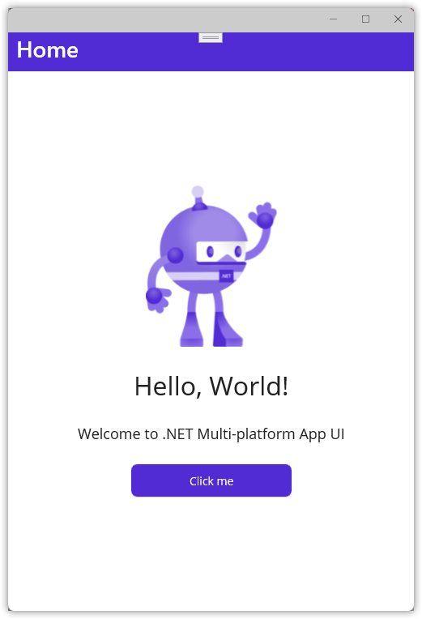
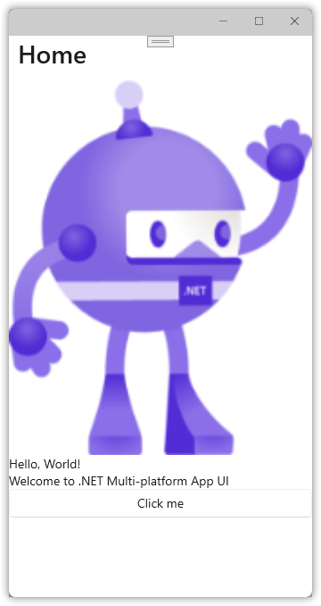
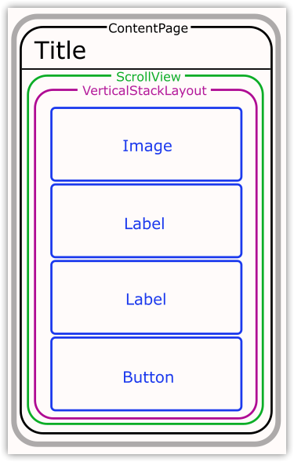
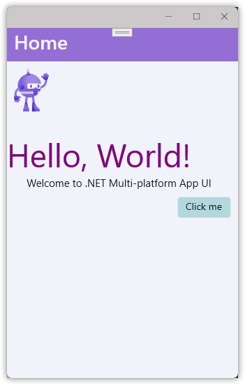
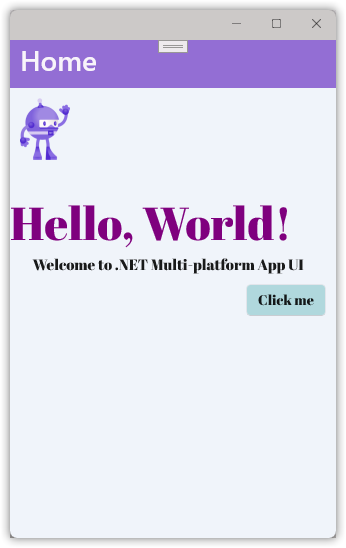
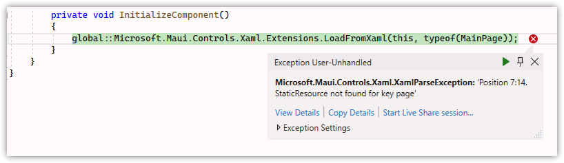

---  
Title          : .NET MAUI Progressing From a Default Project Part 5 - Restyling From Scratch   
PublishedOn    : 2022-07-04 19:00:47 
Slug           : net_maui_progressing_from_a_default_project_part_5_-_restyling_from_scratch
Tags           :  
---

## The Series
Level: Moderate

This series assumes the developer is familiar with .NET MAUI, the Model-View-ViewModel pattern, and has worked through one or more tutorials such as the excellent [James Montemagno's Workshop](https://www.youtube.com/watch?app=desktop&v=DuNLR_NJv8U).

Source: [https://github.com/bladewolf55/net-maui-progression](https://github.com/bladewolf55/net-maui-progression)

*   [Part 1 - Adding the View Model](https://www.softwaremeadows.com/posts/net_maui_progressing_from_a_default_project_part_1_-_adding_the_view_model/)
*   [Part 2 - (The Problem With) Basic Unit Testing](https://www.softwaremeadows.com/posts/net_maui_progressing_from_a_default_project_part_2_-__the_problem_with__basic_unit_testing)
*   [Part 3 - Adding the Model](https://www.softwaremeadows.com/posts/net_maui_progressing_from_a_default_project_part_3_-_adding_the_model_more_testing_and_ddd/)
*   [Part 4 - Putting the View in Its Place](https://www.softwaremeadows.com/posts/net_maui_progressing_from_a_default_project_part_4_-_putting_the_view_in_its_place/)
*   [Part 5 - Restyling From Scratch](https://www.softwaremeadows.com/posts/net_maui_progressing_from_a_default_project_part_5_-_restyling_from_scratch/)

## What Problem Do Styles Solve?
Fundamentally, styles let you declare in one place how something will look no matter where it appears. A style differs (in my mind) from a format. 

Let's consider a button. Here's one with a default format.


It's grey, square, and uses the host's default sans serif typeface positioned top left. Now let's format the button.

> Yes, you're right, some people will say "style" the button. That's OK, I'm drawing a distinction to clarify what styles are. If you prefer, you can think of them later as "named styles." I'll be using the word more casually later on.


Now the button background is blue with rounded corners, the text color is peach with a Bauhaus typeface and centered.

In a larger application, I want to apply the same *format* to each button automatically instead of manually on each one. That way, if I want to change the background to green I can do it in one place. I do that by creating a style.

> This is an application of the [Don't Repeat Yourself (DRY)](https://en.wikipedia.org/wiki/Don%27t_repeat_yourself) principle. 



Styles seem simple, but they get tricky pretty quickly when you want to do things like change a button's style depending on whether it's a Save or Delete (maybe the delete button should be bright red, but otherwise the same as other buttons).

Taken together, styles are part of the application's UI/UX design.

## Starting Our Styles Over
Here's what our app looks like right now.



Let's get rid of all our styles. We'll create new ones later.

1.  In the `Maui.Progression` project `Resources/Styles` folder, delete these two files:
    *   Colors.xslt
    *   Styles.xslt

1.  In `Resources/Fonts`, delete both OpenSans .ttf files.
1.  Open `App.xaml` and delete the Application.Resources node, leaving you with this.
    ```xml
    <?xml version = "1.0" encoding = "UTF-8" ?>
    <Application xmlns="http://schemas.microsoft.com/dotnet/2021/maui"
                xmlns:x="http://schemas.microsoft.com/winfx/2009/xaml"
                xmlns:local="clr-namespace:Maui.Progression"
                x:Class="Maui.Progression.App">
    </Application>
    ```
1.  Open `MauiProgram.cs` and delete these lines.
    ```csharp
    .ConfigureFonts(fonts =>
    {
        fonts.AddFont("OpenSans-Regular.ttf", "OpenSansRegular");
        fonts.AddFont("OpenSans-Semibold.ttf", "OpenSansSemibold");
    });
    ```

    leaving this

    ```csharp
	public static MauiApp CreateMauiApp()
	{
		var builder = MauiApp.CreateBuilder();
		builder
			.UseMauiApp<App>();

		builder.Services.AddSingleton<INumberMapper>(new NumberMapper());
		builder.Services.AddSingleton<Counter>();
		builder.Services.AddSingleton<MainPage>();

        return builder.Build();
	}
    ```
1.  Edit `Maui.Progression.csproj` and comment out the MauiFont Include line.
```xml
		<!-- Custom Fonts -->
		<!--<MauiFont Include="Resources\Fonts\*" />-->
```
1.  Open `MainPage.xaml` and replace with this code. It removes all inline styling.
    > SemanticProperties can be included in styles, but I'm not doing it in this post.
    ```xml
    <?xml version="1.0" encoding="utf-8" ?>
    <ContentPage xmlns="http://schemas.microsoft.com/dotnet/2021/maui"
                xmlns:x="http://schemas.microsoft.com/winfx/2009/xaml"
                x:Class="Maui.Progression.Views.MainPage"
                xmlns:viewmodels="clr-namespace:Maui.Progression.ViewModels;assembly=Maui.Progression.ViewModels"
                x:DataType="viewmodels:Counter"
                >
        <ScrollView>
            <VerticalStackLayout >
                <Image
                    Source="dotnet_bot.png"
                    SemanticProperties.Description="Cute dot net bot waving hi to you!" />
                <Label 
                    Text="Hello, World!"
                    SemanticProperties.HeadingLevel="Level1" />
                <Label 
                    Text="Welcome to .NET Multi-platform App UI"
                    SemanticProperties.HeadingLevel="Level2"
                    SemanticProperties.Description="Welcome to dot net Multi platform App U I" />
                <Button
                    Text="{Binding CountText}"
                    SemanticProperties.Hint="Counts the number of times you click"
                    Command="{Binding IncreaseCounterCommand}" />
            </VerticalStackLayout>
        </ScrollView>
    </ContentPage>
    ```

> **Weirdness**  
> I found the app still runs even if the font files are deleted *and* the `.ConfigureFonts` method is still in place. Maybe that's intentional, but I'd have expected a compile error.

Run the app. It looks pretty horrific, but still works.



## What Are Our Elements?
We're going to style our app, but *what* can we style? Just like on the web, a page is made up of elements in a layout.



All of these elements can be styled. That is, they all have a Style property that can be set to a named style. Setting the element's properties overrides the style.

We can think of our layout as a set of containers. Styles are *inherited*, meaning inner elements (usually) get the same formatting as the outer elements unless overridden.  

We're going to progressively style our app's elements, and then add a button with some overrides.

## The Hard Way
But first, let's format each element separately, starting with the content page. Add a BackgroundColor to `MainPage.xaml`.

```xml
<ContentPage xmlns="http://schemas.microsoft.com/dotnet/2021/maui"
             xmlns:x="http://schemas.microsoft.com/winfx/2009/xaml"
             x:Class="Maui.Progression.Views.MainPage"
             xmlns:viewmodels="clr-namespace:Maui.Progression.ViewModels;assembly=Maui.Progression.ViewModels"
             x:DataType="viewmodels:Counter"
             BackgroundColor="AliceBlue"
             >
```

As expected, this changes the background to a pale blue.


Note a couple of things.

1.  The button background is white. That's because it's not transparent like the labels.
1.  The title background is still white. Why is that?

Our app is using the [Shell App](https://docs.microsoft.com/en-us/dotnet/maui/fundamentals/shell/) method for laying out the overall content, which includes the title element. 

> Think of App Shell as the overall container for your app that all pages inherit from.

Open `AppShell.xaml` and format the Shell.BackgroundColor and Shell.TitleColor.

```xml
<?xml version="1.0" encoding="UTF-8" ?>
<Shell
    x:Class="Maui.Progression.AppShell"
    xmlns="http://schemas.microsoft.com/dotnet/2021/maui"
    xmlns:x="http://schemas.microsoft.com/winfx/2009/xaml"
    xmlns:local="clr-namespace:Maui.Progression.Views"
    Shell.FlyoutBehavior="Disabled" 
    Shell.BackgroundColor="MediumPurple"
    Shell.TitleColor="GhostWhite"
    >
    <ShellContent
        Title="Home"
        ContentTemplate="{DataTemplate local:MainPage}"
        Route="MainPage" />
</Shell>
```

> Note this is also where the default page Title is set. 

> Also, these same properties *can* be set in a view's ContentPage element. So, each page could have a different title color. Whimsy.

Here's the result. (No one ever said I'm good with colors.)


Back to `MainPage.xaml` and well finish our manual formatting.

```xml
<?xml version="1.0" encoding="utf-8" ?>
<ContentPage xmlns="http://schemas.microsoft.com/dotnet/2021/maui"
             xmlns:x="http://schemas.microsoft.com/winfx/2009/xaml"
             x:Class="Maui.Progression.Views.MainPage"
             xmlns:viewmodels="clr-namespace:Maui.Progression.ViewModels;assembly=Maui.Progression.ViewModels"
             x:DataType="viewmodels:Counter"
             BackgroundColor="AliceBlue"
             >
    <ScrollView>
        <VerticalStackLayout>
            <Image
                Source="dotnet_bot.png"
                SemanticProperties.Description="Cute dot net bot waving hi to you!" 
                WidthRequest="50"
                HorizontalOptions="Start"
                Margin="10,10,0,30"/>
            <Label 
                Text="Hello, World!"
                SemanticProperties.HeadingLevel="Level1" 
                FontSize="Header" 
                TextColor="Purple" 
                FontFamily="AbrilFatface"/>
            <Label 
                Text="Welcome to .NET Multi-platform App UI"
                SemanticProperties.HeadingLevel="Level2"
                SemanticProperties.Description="Welcome to dot net Multi platform App U I" 
                FontSize="15"
                HorizontalTextAlignment="Center"
                Margin="0,0,10,10" 
                FontFamily="AbrilFatface" />
            <Button
                Text="{Binding CountText}"
                SemanticProperties.Hint="Counts the number of times you click"
                Command="{Binding IncreaseCounterCommand}" 
                HorizontalOptions="End" 
                Margin="0,0,10,0"
                BackgroundColor="#b0dce1" 
                FontFamily="AbrilFatface"/>
        </VerticalStackLayout>
    </ScrollView>
</ContentPage>
```

Run the app to get this admittedly ugly user experience, but one that demonstrates some features.



Our changes are working except for the font. That's because we need to explicitly load that font resource.

1.  Download the [Abril Fatface](https://fonts.google.com/specimen/Abril+Fatface?query=fatface) font from Google. (Or use some other font file of your choice.)
1.  Unpack and copy the files into the `Resources\Fonts` folder.
1.  In `Maui.Progression.csproj`, uncomment this line to include any font files in the Fonts folder in the app build.
    ```xml
    <MauiFont Include="Resources\Fonts\*" />
    ```
1.  In `MauiProgram.cs` add this code to register the font file and give it a friendly name.
    ```csharp
    builder
        .UseMauiApp<App>()
        .ConfigureFonts(fonts =>
        {
            fonts.AddFont("AbrilFatface-Regular.ttf", "AbrilFatface");
        });
    ```

Restart the app to see the change.



## Page-Level Styles (Ending With Inheritance)
We can format at the lowest level: individual elements. Let's create some styles at the page level.

In `MainPage.xaml`, add a ContentPage.Resources node with the following.

```xml
<ContentPage.Resources>
    <Style x:Key="page" TargetType="ContentPage">
        <Setter Property="BackgroundColor" Value="AliceBlue" />
    </Style>
</ContentPage.Resources>
```

Replace the ContentPage `BackgroundColor="AliceBlue"` property with a Style property. 

```xml
<ContentPage xmlns="http://schemas.microsoft.com/dotnet/2021/maui"
             xmlns:x="http://schemas.microsoft.com/winfx/2009/xaml"
             x:Class="Maui.Progression.Views.MainPage"
             xmlns:viewmodels="clr-namespace:Maui.Progression.ViewModels;assembly=Maui.Progression.ViewModels"
             x:DataType="viewmodels:Counter"
==>          Style="{StaticResource page}"
```

Try running the app. Here we run into an irritating error.



Maybe I'm missing something, but it appears we can't define a ContentPage style for the content page we're in. Harrumph!

Undo both changes above. We *can* create ContentPage styles, but we'll do it later when we move our styles to the application.

For now, add this `ContentPage.Resources` block instead.

```xml
    <ContentPage.Resources>
        <Style TargetType="Label">
            <Setter Property="FontFamily" Value="AbrilFatface"/>
        </Style>
        <Style TargetType="Button">
            <Setter Property="FontFamily" Value="AbrilFatface"/>
        </Style>
    </ContentPage.Resources>
```

In each label and the button, delete the `FontFamily="AbrilFatface"` attribute, then rerun the app, which should look the same as before. All we've done is create a couple of styles that say "If you display a label or a button, use the AbrilFatface font." You can prove it works by changing the FontFamily name to something else such as "Consolas" (on Windows).

These are *implicit* styles. They're applied to elements that match the TargetType exactly.

> **Note**  
> But not to elements derived from the TargetType unless ApplyToDerivedTypes = True. See Microsoft's documentation (linked in Resources) for more details.

Let's convert these to *explicit* styles. We do that by setting the `x:Key` attribute.

```xml
<ContentPage.Resources>
    <Style x:Key="baseLabel" TargetType="Label">
        <Setter Property="FontFamily" Value="AbrilFatface"/>
    </Style>
    
    <Style x:Key="baseButton" TargetType="Button">
        <Setter Property="FontFamily" Value="AbrilFatface"/>
    </Style>
</ContentPage.Resources>
```

Since we've given our styles keys, we need to explicitly use them by using the Style attribute.

```xml
<Label 
    Text="Hello, World!"
    SemanticProperties.HeadingLevel="Level1" 
    FontSize="Header" 
    TextColor="Purple" 
    Style="{StaticResource baseLabel}"
    />
<Label 
    Text="Welcome to .NET Multi-platform App UI"
    SemanticProperties.HeadingLevel="Level2"
    SemanticProperties.Description="Welcome to dot net Multi platform App U I" 
    FontSize="15"
    HorizontalTextAlignment="Center"
    Margin="0,0,10,10" 
    Style="{StaticResource baseLabel}"
        />
<Button
    Text="{Binding CountText}"
    SemanticProperties.Hint="Counts the number of times you click"
    Command="{Binding IncreaseCounterCommand}" 
    HorizontalOptions="End" 
    Margin="0,0,10,0"
    BackgroundColor="#b0dce1" 
    Style="{StaticResource baseButton}"
    />
```

Now let's build on this by defining two label styles that *inherit* from `baseLabel`.

> **Important**  
> Per Microsoft, "An implicit style can be derived from an explicit style, but an explicit style can't be derived from an implicit style."

```xml
<Style x:Key="baseLabel" TargetType="Label">
    <Setter Property="FontFamily" Value="AbrilFatface"/>
</Style>
<Style x:Key="header" TargetType="Label" BasedOn="{StaticResource baseLabel}">
    <Setter Property="FontSize" Value="Header"/>
    <Setter Property="TextColor" Value="Purple"/>
</Style>
<Style x:Key="greeting" TargetType="Label" BasedOn="{StaticResource baseLabel}">
    <Setter Property="FontSize" Value="15"/>
    <Setter Property="HorizontalTextAlignment" Value="Center"/>
    <Setter Property="Margin" Value="0,0,10,10"/>
</Style>
```

The formatting can be removed from the labels.

```xml
<Label 
    Text="Hello, World!"
    SemanticProperties.HeadingLevel="Level1" 
    Style="{StaticResource header}"
    />
<Label 
    Text="Welcome to .NET Multi-platform App UI"
    SemanticProperties.HeadingLevel="Level2"
    SemanticProperties.Description="Welcome to dot net Multi platform App U I" 
    Style="{StaticResource greeting}"
        />
```

Let's assume our `baseButton` is going to use all the formatting, not just the font.

```xml
<Style x:Key="baseButton" TargetType="Button">
    <Setter Property="FontFamily" Value="AbrilFatface"/>
    <Setter Property="HorizontalOptions" Value="End"/>
    <Setter Property="Margin" Value="0,0,10,0"/>
    <Setter Property="BackgroundColor" Value="#b0dce1"/>
</Style>
```

Which lets us simplify the button element.

```xml
<Button
    Text="{Binding CountText}"
    SemanticProperties.Hint="Counts the number of times you click"
    Command="{Binding IncreaseCounterCommand}" 
    Style="{StaticResource baseButton}"
    />
```

And do the same thing with the image. Why? I've found it's generally a good practice to keep all your styling together, even what seems like one-offs. 

> **Concept**  
> What this helps with is *separation of concerns*. We're separating out the styling (how elements look) from the semantics (what elements mean), letting us encapsulate our code and improve maintainability.

```xml
<Style x:Key="pageImage" TargetType="Image">
    <Setter Property="Source" Value="dotnet_bot.png"/>
    <Setter Property="WidthRequest" Value="50"/>
    <Setter Property="HorizontalOptions" Value="Start"/>
    <Setter Property="Margin" Value="10,10,0,30"/>
</Style>
```

```xml
<Image
    Source="dotnet_bot.png"
    SemanticProperties.Description="Cute dot net bot waving hi to you!" 
    Style="{StaticResource pageImage}"/>
```

Inheritance is nice and all, and tempting, but let's redo our styles to use what's often more powerful: composition through classes.

## Styling With Class(es)
One issue we ran into above is, in order to define named styles for our labels, we needed to inherit from a named base style.

> **Comparison**  
> That's not the way it works in Cascading Style Sheets (CSS), where you can define styles for all label tags, then named styles that override those styles (using either an id or class identifier). 

When we use inheritance, we're stuck with whatever styles we defined in the base style. We can *override* those styles, but not *remove* them.

If we use classes, we can define characteristics or behaviors that we're styling for, define small, discreet sets of styles, and combine them. For example, maybe all labels have a blue background ("normal"), some get a bold font ("strong"), others get a large font size ("big"). Using classes, we could style a label as "normal strong", "normal big", or "normal strong big".

In our case, we're going to replace our inherited label styles with class-based styles, just to prove it works.

Remove/replace the `x:Key` attributes as shown.

```xml
<Style TargetType="Label">
    <Setter Property="FontFamily" Value="AbrilFatface"/>
</Style>
<Style Class="header" TargetType="Label" >
    <Setter Property="FontSize" Value="Header"/>
    <Setter Property="TextColor" Value="Purple"/>
</Style>
<Style Class="greeting" TargetType="Label">
    <Setter Property="FontSize" Value="15"/>
    <Setter Property="HorizontalTextAlignment" Value="Center"/>
    <Setter Property="Margin" Value="0,0,10,10"/>
</Style>
```

Update the label elements to use the StyleClass attribute.

```xml
<Label 
    Text="Hello, World!"
    SemanticProperties.HeadingLevel="Level1" 
    StyleClass="header"
    />
<Label 
    Text="Welcome to .NET Multi-platform App UI"
    SemanticProperties.HeadingLevel="Level2"
    SemanticProperties.Description="Welcome to dot net Multi platform App U I" 
    StyleClass="greeting"
    />
```

Restart the app and it should look the same as before.

> **Important**  
> There's a downside to using classes. You can't interactively change style values while the app is running, because the changes aren't supported by Hot Reload. This is unfortunate, because using classes is really valuable and the friction might make developers shy away from them.

## Movin' On Up! Using Global Styles
The next level up for styles is the Application. Here you define styles used throughout your pages. It's where you should expect most of your styles to live.

Cut the entire `ContentPage.Resources` node from `MainPage.xaml` and paste it into `App.xaml` inside the `Application` node. Then rename it to "Application.Resources".

```xml
<?xml version = "1.0" encoding = "UTF-8" ?>
<Application xmlns="http://schemas.microsoft.com/dotnet/2021/maui"
             xmlns:x="http://schemas.microsoft.com/winfx/2009/xaml"
             xmlns:local="clr-namespace:Maui.Progression"
             x:Class="Maui.Progression.App">
    <Application.Resources>
        <Style x:Key="pageImage" TargetType="Image">
            <Setter Property="Source" Value="dotnet_bot.png"/>
            <Setter Property="WidthRequest" Value="50"/>
            <Setter Property="HorizontalOptions" Value="Start"/>
            <Setter Property="Margin" Value="10,10,0,30"/>
        </Style>
        <Style TargetType="Label">
            <Setter Property="FontFamily" Value="AbrilFatface"/>
        </Style>
        <Style Class="header" TargetType="Label" >
            <Setter Property="FontSize" Value="Header"/>
            <Setter Property="TextColor" Value="Purple"/>
        </Style>
        <Style Class="greeting" TargetType="Label">
            <Setter Property="FontSize" Value="15"/>
            <Setter Property="HorizontalTextAlignment" Value="Center"/>
            <Setter Property="Margin" Value="0,0,10,10"/>
        </Style>
        <Style x:Key="baseButton" TargetType="Button">
            <Setter Property="FontFamily" Value="AbrilFatface"/>
            <Setter Property="HorizontalOptions" Value="End"/>
            <Setter Property="Margin" Value="0,0,10,0"/>
            <Setter Property="BackgroundColor" Value="#b0dce1"/>
        </Style>
    </Application.Resources>
</Application>
```

That's . . . it. The app runs the same as before. 

Let's deal with something from earlier, though. Remember our content page background color? We can create a style for content pages here. Add the following.

```xml
<Style TargetType="ContentPage">
    <Setter Property="BackgroundColor" Value="AliceBlue"/>
</Style>
```

Back in `MainPage.xaml`, delete the ContentPage BackgroundColor attribute.

```xml
<ContentPage xmlns="http://schemas.microsoft.com/dotnet/2021/maui"
             xmlns:x="http://schemas.microsoft.com/winfx/2009/xaml"
             x:Class="Maui.Progression.Views.MainPage"
             xmlns:viewmodels="clr-namespace:Maui.Progression.ViewModels;assembly=Maui.Progression.ViewModels"
             x:DataType="viewmodels:Counter"
-> DELETE    BackgroundColor="AliceBlue"
             >
```

Rerun the app and you should still see a blue background. 

But you don't! Why not? Because our pages are derived from ContentPage, which isn't obvious. The solution?

```xml
<Style TargetType="ContentPage" ApplyToDerivedTypes="True">
    <Setter Property="BackgroundColor" Value="AliceBlue" />
</Style>
```

Now the background shows as expected.

## Take Your Styles Outside, Young Man
If you've worked with web sites, you know that separate style files is a big deal. And, as noted above, it's a good practice. So let's come full circle and pull our styles out into their own file.

1.  Add a file named `Styles.xaml` to the `Resources/Styles` folder.
1.  Cut the `Application.Resources` node from `App.xaml` and paste it into `Styles.xaml`.
1.  Rename `Application.Resources` to `ResourceDictionary`
1.  Replace the top of the file like so.
    ```xml
    <?xml version="1.0" encoding="UTF-8" ?>
    <?xaml-comp compile="true" ?>
    <ResourceDictionary 
        xmlns="http://schemas.microsoft.com/dotnet/2021/maui"
        xmlns:x="http://schemas.microsoft.com/winfx/2009/xaml">
    ```

Here's the complete file.

```xml
<?xml version="1.0" encoding="UTF-8" ?>
<?xaml-comp compile="true" ?>
<ResourceDictionary 
    xmlns="http://schemas.microsoft.com/dotnet/2021/maui"
    xmlns:x="http://schemas.microsoft.com/winfx/2009/xaml">
    <Style TargetType="ContentPage" ApplyToDerivedTypes="True">
        <Setter Property="BackgroundColor" Value="AliceBlue"/>
    </Style>
    <Style x:Key="pageImage" TargetType="Image">
        <Setter Property="Source" Value="dotnet_bot.png"/>
        <Setter Property="WidthRequest" Value="50"/>
        <Setter Property="HorizontalOptions" Value="Start"/>
        <Setter Property="Margin" Value="10,10,0,30"/>
    </Style>
    <Style TargetType="Label">
        <Setter Property="FontFamily" Value="AbrilFatface"/>
    </Style>
    <Style Class="header" TargetType="Label" >
        <Setter Property="FontSize" Value="Header"/>
        <Setter Property="TextColor" Value="Purple"/>
    </Style>
    <Style Class="greeting" TargetType="Label">
        <Setter Property="FontSize" Value="15"/>
        <Setter Property="HorizontalTextAlignment" Value="Center"/>
        <Setter Property="Margin" Value="0,0,10,10"/>
    </Style>
    <Style x:Key="baseButton" TargetType="Button">
        <Setter Property="FontFamily" Value="AbrilFatface"/>
        <Setter Property="HorizontalOptions" Value="End"/>
        <Setter Property="Margin" Value="0,0,10,0"/>
        <Setter Property="BackgroundColor" Value="#b0dce1"/>
    </Style>
</ResourceDictionary>
```

Back in `App.xaml`, we're going to merge our styles file. If we had more than one file (likely), we'd merge them all this way.

```xml
<?xml version = "1.0" encoding = "UTF-8" ?>
<Application xmlns="http://schemas.microsoft.com/dotnet/2021/maui"
             xmlns:x="http://schemas.microsoft.com/winfx/2009/xaml"
             xmlns:local="clr-namespace:Maui.Progression"
             x:Class="Maui.Progression.App">
    <Application.Resources>
        <ResourceDictionary>
            <ResourceDictionary.MergedDictionaries>
                <ResourceDictionary Source="Resources/Styles/Styles.xaml"/>
            </ResourceDictionary.MergedDictionaries>
        </ResourceDictionary>
    </Application.Resources>
</Application>
```

Rerun the app and, as before, it has our styles.

## Wrap Up
We covered a lot, but XAML styles are a much deeper subject and I won't say I've explored its fathoms. Be sure to check out the links below.

Next up: Build (and maybe deployment)!

## Resources
*   [Style apps using XAML - .NET MAUI | Microsoft Docs](https://docs.microsoft.com/en-us/dotnet/maui/user-interface/styles/xaml)
*   [Fonts in .NET MAUI - .NET MAUI | Microsoft Docs](https://docs.microsoft.com/en-us/dotnet/maui/user-interface/fonts)
*   [Resource dictionaries - .NET MAUI | Microsoft Docs](https://docs.microsoft.com/en-us/dotnet/maui/fundamentals/resource-dictionaries)
