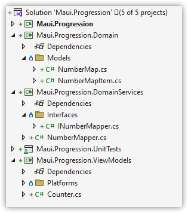
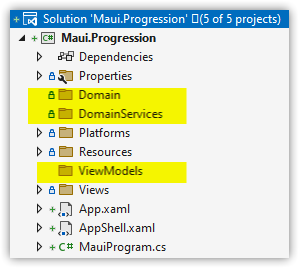
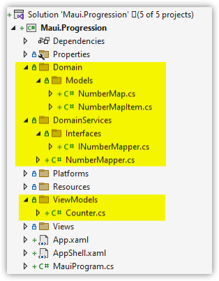
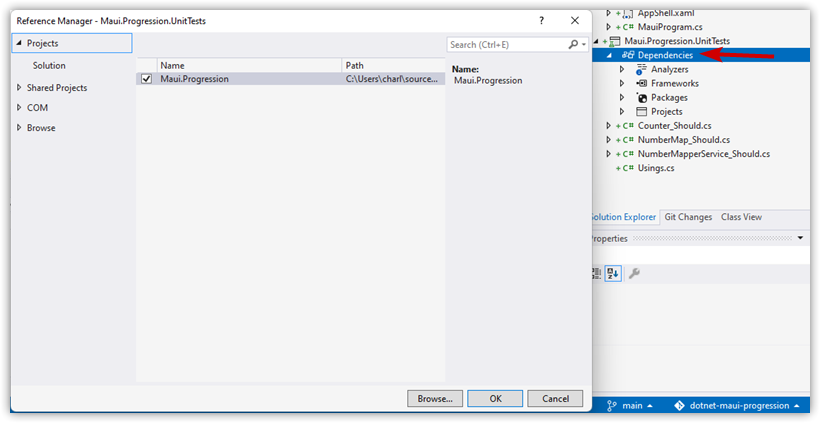
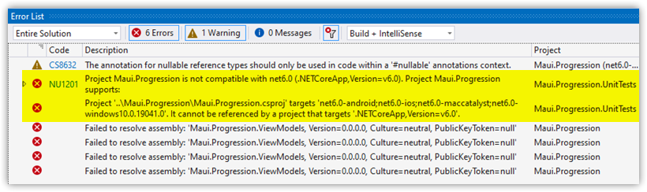
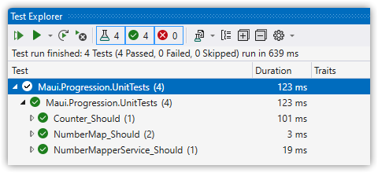

---  
Title          : .NET MAUI Progressing From a Default Project Part 6 - Revisiting Unit Testing  
PublishedOn    : 2022-07-19 12:50:14  
Slug           : net_maui_progressing_from_a_default_project_part_6_-_revisiting_unit_testing
Tags           :  
---


## The Series
Level: Moderate

This series assumes the developer is familiar with .NET MAUI, the Model-View-ViewModel pattern, and has worked through one or more tutorials such as the excellent [James Montemagno's Workshop](https://www.youtube.com/watch?app=desktop&v=DuNLR_NJv8U).

Source: [https://github.com/bladewolf55/net-maui-progression](https://github.com/bladewolf55/net-maui-progression)

*   [Part 1 - Adding the View Model](https://www.softwaremeadows.com/posts/net_maui_progressing_from_a_default_project_part_1_-_adding_the_view_model/)
*   [Part 2 - (The Problem With) Basic Unit Testing](https://www.softwaremeadows.com/posts/net_maui_progressing_from_a_default_project_part_2_-__the_problem_with__basic_unit_testing)
*   [Part 3 - Adding the Model](https://www.softwaremeadows.com/posts/net_maui_progressing_from_a_default_project_part_3_-_adding_the_model_more_testing_and_ddd/)
*   [Part 4 - Putting the View in Its Place](https://www.softwaremeadows.com/posts/net_maui_progressing_from_a_default_project_part_4_-_putting_the_view_in_its_place/)
*   [Part 5 - Restyling From Scratch](https://www.softwaremeadows.com/posts/net_maui_progressing_from_a_default_project_part_5_-_restyling_from_scratch/)
*   [Part 6 - Revisiting Unit Testing](https://www.softwaremeadows.com/posts/net_maui_progressing_from_a_default_project_part_6_-_revisiting_unit_testing/)


## (Someone Else's) Solution to Unit Testing .NET MAUI Projects
In part 2, I discussed how .NET MAUI didn't support unit testing, and that you could separate out the namespaces into their own projects. And that's still true and useful. But for many projects that's overkill. In my opinion, it's especially egregious for unit testing the View Models, which I'd prefer stay with the UI project.

In his video [Unit Testing .NET MAUI Apps with xUnit](https://www.youtube.com/watch?app=desktop&v=C9vIDLQwc7M), Gerald Versluis demonstrates how to modify the project to allow direct unit testing. It's pretty simple, I must say, and for fun I'll take the solution from part 5 and *collapse* it back into a single project. 

> Ideally, as long as I keep the namespaces the same, everything should work the same and pass perfectly with very little effort.

## Creating the namespace folder structure
Right now, we have separate projects for our domain-driven design.



Let's recreate those namespaces in the `Maui.Progression` project. Create folders like so.



Now copy the  files and folders from the projects into the new folders.



Add this NuGet package to the `Maui.Progression` project.

*   Microsoft.Toolkit.Mvvm

> If we had other dependencies, they'd need to be added as well.

In the 'Maui.Progression.UnitTests' project, add a project reference to `Maui.Progression`



Now delete these projects:

*   Maui.Progression.Domain
*   Maui.Progression.DomainServices
*   Maui.Progression.ViewModels

> Their references will automatically be removed from the unit test project.

You can try to simply rebuild the solution. But I had to close and reopen Visual Studio, then clean/rebuild. The build will fail, which is expected.



## The Secret Sauce
As discussed in part 2, the reason I couldn't just unit test the .NET MAUI project is because it needs to include a framework of `net6.0`. The other reason I didn't know about, that Versluis explains, is if I add the `net6.0` framework it needs to build as a DLL, not an Exe. This removes the "Main method required" error.

Here's how to do that.

Edit your `Maui.Progression.csproj` file, either by selecting it or right-click the project name and choosing "Edit Project File".

Modify the `TargetFrameworks` line to include `net6.0`. I put it first.

```xml
<TargetFrameworks>net6.0;net6.0-android;net6.0-ios;net6.0-maccatalyst</TargetFrameworks>
```

Here's the kicker. Modify the OutputType to *conditionally* generate an Exe for everything except the `net6.0` framework. DLL is the default when EXE isn't selected.

```xml
<OutputType Condition="'$(TargetFramework)' != 'net6.0'">Exe</OutputType>
```

Clean and Rebuild the solution. You many need to close/reopen Visual Studio.

The solution *still* won't build, because the `MainPage.xaml` is attempting to reference anx external assembly.

Open that file and change the namespace attributes to this:

```xml
xmlns:viewmodels="clr-namespace:Maui.Progression.ViewModels"
```

Clean and Rebuild is now successful!

Run the tests and they pass, like magic.



## Pros/Cons
The advantage to keeping all the code in one project is it's a little quicker to navigate. 

One disadvantage is separate projects can force better testing design.

But another, subtler disadvantage is build time. If there are no changes to the UI, and only changes to the dependency projects, the build is substantially faster. This matters when doing test-driven development because we want to keep our feedback loop fast.

You need to decide what balance matters to you.

## Wrap Up
We saw how to enable unit testing against a .NET MAUI project directly by building it as a DLL against the `net6.0` framework target. There are still challenges in unit testing where the code includes things like `SemanticReader` calls; I'm hoping to tackle that soon.

Next Up: Build (and maybe deployment), I hope.

